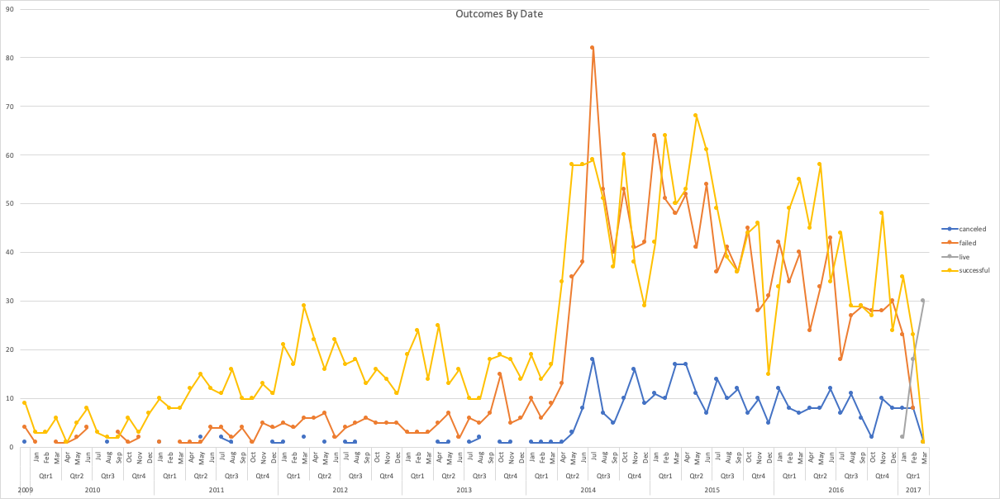
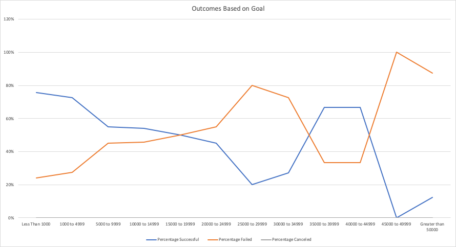

# An Analysis of Kickstarter Campaigns
Performing analysis on Kickstarter data to uncover trends
###### Analysis by Date

### Challenge
#### Part 1
Part 1 of the challenge section includes analysis on the campaign's outcome for the Plays subcategory. The campaign goal amount was divided into tweleve different ranges and the outcomes of each campaign was put into its respective goal range by using the COUNTIFS() formula in excel. The results for Part 1 are shown below.

