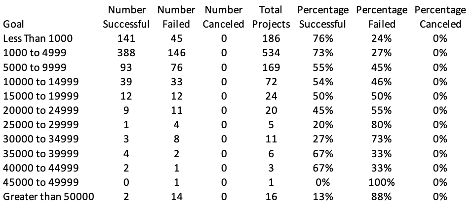
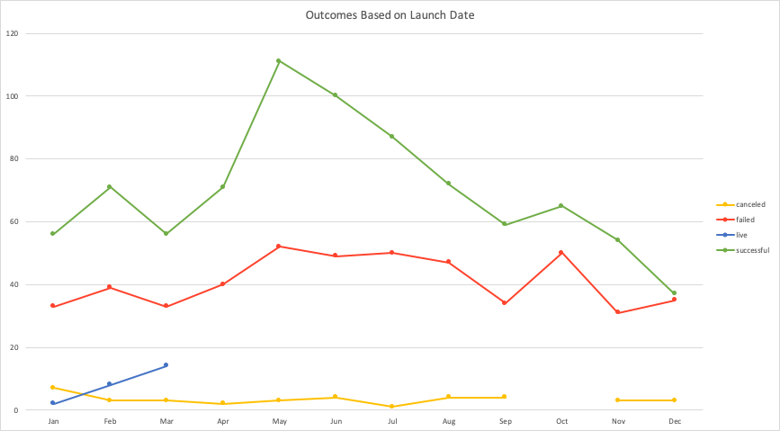

# An Analysis of Kickstarter Campaigns

### Module Practice
Performing analysis on Kickstarter data to uncover trends from Module 1.
###### Analysis by Date

### Challenge Submission
#### Part 1
Part 1 of the challenge section includes analysis on the campaign's outcome for the Plays subcategory. The campaign goal amount was divided into tweleve different ranges and the outcomes of each campaign was put into its respective goal range by using the COUNTIFS() formula in Excel. The results for Part 1 are shown below.

#### Part 2
Part 2 of the challenge includes an analysis of campaign outcames for the Theater parent category by utlizing Excel Pivot Tables. The results of this analysis are shown in the chart below.

#### Challenge Conclusions
For the plays subcategory, a campaign goal of "less than $1000" resulted in the highest percentage of successful campaigns (76%) and lowest percentage of failed campaigns (24%). The $1000 to $4999 goal range had the most campaings, therefore having more successful campaigns compared to the "less than $1000" range, but was the second highest when looking at percentage successful (73%). As the goal amount is increased, the percentage of failed campaigns increases. Since the majority of the play campaigns had goals between $0 to $14999, the percentage results for higher goal ranges such as $35000 to $49999 are misrepresented due to the lack of total projects at the higher goal ranges. More campaigns between $35000 to $49999 would have to be analyzed in order to draw a more accurate conclusion for these specific goal ranges and a misrepresentation of percentage successful campaigns is shown due to the lack of projects. This is one recomendation and limation of the data in this analysis. Lastly, there were no cancelled campaigns for any goal amount in the plays subcategory.

When analyzing the Outcomes by Date pivot chart and table, there is an even spread of the total amount of campaings in each month to draw accurate conclusions from the data. The most successful campaigns occur in the summer months of May, June, and July. The month of December is the month with the least amount of succesful campaigns. 

Based on these analysis and conclusions, I would recommend to hold to majority of campaigns between the months of May and July with a campign goal up to $5000. However, I would suggest looking into the failed campaigns to see how short the amount raised was of the goal. A failed campaign that is short $1000 of a $15000 goal ultimately raises more money than a $5000 campaign that is successful at $6000. Perhaps analyzing the amount pledged regardless of goal could give insight on the average amount raised and may help with determining a better goal amount for future campaigns in certain months.
